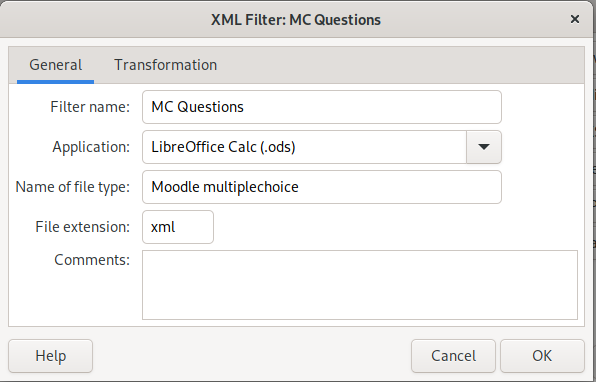
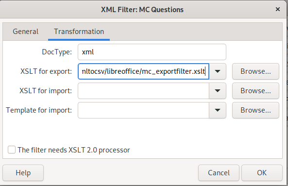

## Libreoffice template and filter

The files in this directory are meant to be used with Libreoffice calc to
create multiple choice questions and to export these as XML to be impored
into Moodle.

In Libreoffice 

1. Open Libeoffice calc and go to *Tools* -> *Macros* -> *XML Filter settings*
2. Create a new filter as shown in the screenshots, select the XSLT file from
this project.
3. Open the template file (.ods) and start editing your questions.
4. In the file menu choose *Export*, select the newly created filter from step 2
in the selection at the right bottom corner and save the file.

This XML file can now be impored into Moodle.

### Troubleshooting

If the import fails for some reason:

* Check that the columns sequence is not changed
* Check that the grading numbers are 0 to 100 (when using percent rates)
